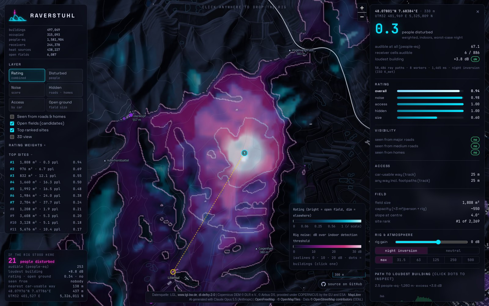

# [raverstuhl](https://raverstuhl.lol/)

**Computing outdoor noise pollution in the Kaiserstuhl/Freiburg region.**

This demo combines open geodata (laser-scan terrain and surface models, 3D buildings, OpenStreetMap)
with an octave-band outdoor sound-propagation model (ISO 9613-2). For every open field it estimates how
many people an outdoor event would disturb, whether it can be seen from roads and homes, and whether a
car can get there. Everything ends up on an interactive map at **[raverstuhl.lol](https://raverstuhl.lol/)**.



- **Heatmaps** of the rating, people disturbed, visibility and access, over shaded relief or in 3D.
- **Click anywhere** to drop a rig: your browser traces ~60,000 sound paths over the terrain in about
  a second and draws the noise footprint.
- **Path inspector:** the terrain profile, the diffraction path over the hills, and every attenuation
  term per frequency band for any building.
- **Listen:** a synthesised techno loop, filtered the way the sound arrives at a neighbour's window.

## How it works

1. **Terrain.** LGL DGM1 (terrain) and DOM1 (surface) at 1 m become a 2 m terrain model and a height
   map of vegetation and buildings. Copernicus GLO-30 fills an 8 km buffer around the area.
2. **Receivers.** Every LoD2 building gets an estimated number of occupants (footprint × storeys) and a
   night-time weight (homes 1, workplaces 0.15, barns 0).
3. **Candidates.** Open, flat, smooth ground at least 20 m wide and 700 m², outside water and nature
   reserves, within 150 m of a way a car can use.
4. **Sound.** ISO 9613-2 per octave band (31.5–500 Hz): spherical spreading, air absorption, ground
   effect, diffraction over the terrain's upper convex hull, foliage, and the downwind/inversion
   correction for a worst-case night. A building counts as disturbed when the bass is audible indoors
   with the window tilted open.
5. **Visibility.** Viewsheds from major roads, medium roads and upper-floor windows. Anything more than
   4 m tall (trees, buildings) blocks the view.
6. **Rating.** The weighted geometric mean of noise, access, hidden and size scores.

All model parameters (rig spectrum, thresholds, weights, filters) live in
[`configs/defaults.yaml`](configs/defaults.yaml). [`docs/plan.md`](docs/plan.md) has the
background, the decisions and the known limitations.

## Repository layout

```
configs/          defaults.yaml (model) + one file per area (breisgau.yaml)
src/geoacoustics/ Python pipeline: ingest, propagation (numba), visibility, scoring, web export
tests/            pytest: analytic acoustics cases, tiling, config
web/              the website: TypeScript + MapLibre, static, no backend
  src/propagation.ts   TypeScript port of the propagation kernel (tested against the Python one)
  deploy/              nginx snippet
docs/             plan and notes
```

## Setup

You need [uv](https://docs.astral.sh/uv/), Node.js ≥ 18 and git. uv installs its own Python 3.12.

```sh
git clone https://github.com/TimSteinke/raverstuhl.git
cd raverstuhl
uv sync                      # Python environment and dependencies
uv run pytest                # optional: model tests
(cd web && npm install)      # website dependencies
```

Disk space and runtime for the full Kaiserstuhl/Freiburg area (about 1,100 km²):

- about 8 GB of downloads and 1.5 GB of intermediate files
- about 20 minutes of computing on a laptop
- plus about an hour for the first downloads, mostly the slow public Overpass servers

## Importing data

An **area** is defined by ALKIS exports, one zip per *Gemarkung* (cadastral district), from the
[LGL open-data portal](https://opengeodata.lgl-bw.de/). The pipeline reads each Gemarkung's extent and
downloads everything else itself: DGM1, DOM1 and LoD2 tiles from LGL, OSM data via Overpass, and the
Copernicus DEM.

1. **Get the ALKIS zips.** Download the Gemarkungen you want (format "NAS") into a folder listed under
   `aoi.alkis_dirs` in the area config, e.g. `data/raw/alkis/`. Or start with a few and let
   RAVERSTUHL fill the holes:

   ```sh
   uv run geoacoustics alkis-fill configs/breisgau.yaml --dry-run   # list Gemarkungen that fill gaps
   uv run geoacoustics alkis-fill configs/breisgau.yaml             # download them to data/raw/alkis/
   ```

   `alkis-fill` uses the portal's Gemarkung index. It picks every missing Gemarkung that is at least
   half inside the convex hull of the ones you already have, which closes holes and joins separate
   parts.

2. **Check coverage.** This writes Gemarkung outlines (built from the ALKIS parcels), enclosed gaps
   and the download status of each tile:

   ```sh
   uv run geoacoustics build configs/breisgau.yaml download coverage
   ```

   Open `web/coverage.html?area=breisgau` in the dev server (see below) to inspect them.

3. **Build.**

   ```sh
   uv run geoacoustics build configs/breisgau.yaml                   # all stages
   uv run geoacoustics build configs/breisgau.yaml --from noise      # resume from a stage
   uv run geoacoustics build configs/breisgau.yaml noise score       # run single stages
   ```

| stage | does |
|---|---|
| `download` | area from ALKIS extents; fetch missing LGL tiles into `data/raw/lgl/` |
| `coverage` | debug data for `web/coverage.html` |
| `terrain` | 2 m terrain + vegetation height, 10 m propagation terrain with an 8 km buffer |
| `osm` | ways, water, protected areas, buildings; cached in 10 km tiles under `data/raw/osm/tiles/` |
| `receivers` | buildings → occupants and night weights, pooled into receiver cells |
| `candidates` | open fields reachable by car |
| `visibility` | viewsheds from roads and homes |
| `noise` | propagation for every candidate, plus a 50 m heatmap of the whole area |
| `score` | ratings, ranking, merging neighbouring fields into sites |
| `export_web` | website data in `web/public/data/<area>/` and the index `web/public/data/areas.json` |

Every stage reads and writes files (GeoTIFF, GeoPackage, Parquet in `data/interim/<area>/`), so it
can be rerun on its own, and the results can be inspected in QGIS. Downloads are cached. Tiles the
portal doesn't have (outside Baden-Württemberg) are remembered in `data/raw/lgl/_missing.txt`.

**Another area:** copy `configs/breisgau.yaml`, change `name`, `title` and `aoi.alkis_dirs`, and
build it. The site shows an area switcher when more than one area is exported.

## Website

The site is fully static. The heatmaps are precomputed, and the noise map for a click is computed
in the browser by a pool of Web Workers.

```sh
cd web
npm run dev        # development server on http://127.0.0.1:5173
npm test           # TypeScript propagation + scoring vs. the Python pipeline's test vectors
npm run build      # production build → web/dist/
```

`npm test` needs exported data, since it compares against the test vectors that `export_web`
writes.

**Deploying:** `web/dist/` works from any path on any static host. For nginx, either serve it at the
root of a domain with [`web/deploy/nginx-root.conf`](web/deploy/nginx-root.conf), as raverstuhl.lol
does, or copy it to e.g. `<webroot>/raverstuhl/` and include
[`web/deploy/nginx-location.conf`](web/deploy/nginx-location.conf) in your `server { … }` block. The snippet does three things:

- sets the `.mjs` MIME type, which MapLibre's worker module needs
- gzips the data files
- redirects `/raverstuhl` to `/raverstuhl/`

The Kaiserstuhl/Freiburg export is about 240 MB. A visitor downloads about 50 MB up front (less
with gzip), plus terrain tiles around each clicked point.

At runtime the site loads map tiles and fonts from [OpenFreeMap](https://openfreemap.org/) and fonts
from Google Fonts.

## Data sources

- Datenquelle: LGL, [www.lgl-bw.de](https://www.lgl-bw.de),
  [dl-de/by-2-0](https://www.govdata.de/dl-de/by-2-0): DGM1, DOM1, LoD2, ALKIS
- © [OpenStreetMap](https://www.openstreetmap.org/copyright) contributors, ODbL: roads, tracks,
  buildings outside LoD2, water, protected areas, map tiles
- Copernicus DEM GLO-30 © DLR e.V. 2010–2014 and © Airbus Defence and Space GmbH 2014–2018, provided
  under COPERNICUS by the European Union and ESA: terrain outside the LGL area
- Map tiles [OpenFreeMap](https://openfreemap.org/) / [OpenMapTiles](https://openmaptiles.org/),
  rendering [MapLibre GL JS](https://maplibre.org/)

## Disclaimer

**Educational purposes only.** RAVERSTUHL demonstrates outdoor sound propagation and open geodata, and
takes no responsibility for unsanctioned parties or any other use of this information. Respect nature
and your neighbours.

**Vibecoded** This project, including its code, noise model, data processing and texts,
was recklessly vibecoded and may contain errors. Its results are estimates, not a
noise assessment.
